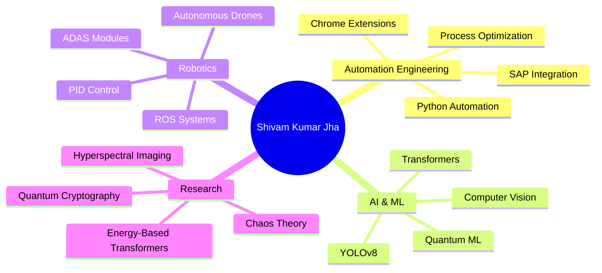

<div align="center">

<!-- Animated Typing Header -->


<!-- Animated Wave -->


</div>

<!-- Animated About Section with Glitch Effect -->
<p align="center">
  
</p>

<!-- Animated Snake eating contributions -->
<div align="center">
  <picture>
    <source media="(prefers-color-scheme: dark)" srcset="https://github.com/yourfiyan/yourfiyan/blob/output/github-contribution-grid-snake-dark.svg">
    <source media="(prefers-color-scheme: light)" srcset="https://github.com/yourfiyan/yourfiyan/blob/output/github-contribution-grid-snake.svg">
    
  </picture>
</div>

---

## 🚀 About Me


```yaml
name: Shivam Kumar Jha
located_in: New Delhi, India
current_focus: Automation Engineering @ Lam Research
education:
  - "B.Tech Computer Science"
  - "Maharaja Agrasen Institute of Technology"
  - "Expected: May 2026"

fields_of_interests:
  - "Quantum-Resistant Cryptography"
  - "Autonomous Systems & Robotics"
  - "AI/ML & Computer Vision"
  - "Enterprise Automation"
  - "Full-Stack Development"

currently_learning:
  - "Building Mobile OS in Rust"
  - "Advanced Quantum Computing"
  - "Drone Automation Systems"

2025_goals:
  - "Pioneer quantum-resistant cryptography"
  - "Publish research papers"
  - "Contribute to major open-source projects"
  - "Complete competition drones"
```

<br clear="right"/>

---

## 💼 Professional Experience

<details open>
<summary><b>🔧 Automation Engineering Intern @ Lam Research</b> <i>(Jun 2025 - Present)</i></summary>
<br>

```python
impact = {
    "automation_solutions": 15,
    "manual_hours_eliminated": 2000,
    "departments": ["Proto4lab", "Pilot MPM", "CPE", "GSCM", "CEM"],
    "technologies": ["Python", "SAP ABAP", "JavaScript", "C#"],
    "key_achievements": [
        "🎯 ZERF Automation: 3hrs → 15min (92% time reduction)",
        "📊 Power BI Dashboard: 10,000+ data points/week",
        "⚡ Chrome Extension: 60% faster BOM extraction",
        "✨ 99.9% transaction accuracy across 500+ operations"
    ]
}
```

</details>

<details>
<summary><b>🚁 UAV Engineering Intern @ NDRF 8th Battalion</b> <i>(Jan 2025 - Mar 2025)</i></summary>
<br>

```python
project_rakshak = {
    "type": "Autonomous Disaster Response Drone",
    "obstacle_avoidance": "80% accuracy",
    "hardware": ["PixHawk", "Raspberry Pi"],
    "impact": "Supporting 30M+ disaster-affected population",
    "features": ["ADAS modules", "Real-time aerial assessment"]
}
```

</details>

<details>
<summary><b>🤖 Backend & AI Engineering Intern @ National Informatics Center</b> <i>(Jul 2024 - Sep 2024)</i></summary>
<br>

```python
national_awards_portal = {
    "users": "300,000+",
    "technology": ["YOLOv8", "Vision Transformer"],
    "model_accuracy": "89%",
    "deployment": "Production-ready AI authentication system",
    "optimization": "Iterative A/B testing"
}
```

</details>

---

## 🏆 Achievements & Highlights

<div align="center">

| 🎖️ Achievement | 📊 Impact | 🔗 Details |
|:---:|:---:|:---:|
| **National Champion** | Build for Bharat | 1000+ SKUs digitized in 17 languages |
| **Lam Research Challenge** | Top 25 Nationally | Led to internship offer |
| **60+ Hackathons** | Finals Reached | Technical Lead & Strategist |
| **BYTE Tech Society** | 100+ Members | Founded & President |
| **Research Papers** | In Submission | Quantum Cryptography & AI |

</div>


---

## 🔬 Featured Research Projects

<table>
<tr>
<td width="50%">

### 🔐 LostInEffect
**Quantum-Resistant Cryptography**


```python
technologies = ["Python", "TensorFlow", "Delithium"]
innovation = "Chaos theory + Butterfly effect"
status = "Research paper in submission"
threat_model = "Quantum computing attacks"
```

[](https://github.com)

</td>
<td width="50%">

### 🛰️ BEYOND GENERATION
**Hyperspectral Anomaly Detection**


```python
technologies = ["PyTorch", "LRSR", "EBT"]
innovation = "First EBT + LRSR integration"
dataset = "30km satellite imagery"
performance = "Top-tier PR-AUC scores"
```

[](https://github.com)

</td>
</tr>
</table>

---

## 💻 Tech Stack & Skills

<div align="center">

### Languages


</div>

<details>
<summary><b>🎨 Frontend & UI/UX</b></summary>
<br>


</details>

<details>
<summary><b>⚙️ Backend & APIs</b></summary>
<br>


</details>

<details>
<summary><b>🤖 AI/ML & Data Science</b></summary>
<br>


</details>

<details>
<summary><b>☁️ Cloud & DevOps</b></summary>
<br>


</details>

<details>
<summary><b>🗄️ Databases</b></summary>
<br>


</details>

<details>
<summary><b>🔧 Tools & Hardware</b></summary>
<br>


</details>


---

## 📊 GitHub Statistics

<div align="center">
  
  
</div>

<div align="center">
  
  
</div>

### 🏆 GitHub Trophies
<div align="center">
  
</div>

### 📈 Contribution Graph
<div align="center">
  
</div>

---

## 🎯 Current Focus & Learning

<div align="center">



</div>

---

## 🌐 Connect With Me

<div align="center">

[](https://linkedin.com/in/shivam-kumar-jha-35686a238/)
[](https://github.com/Shivoo29)
[](mailto:2004skj@gmail.com)
[](https://instagram.com/entangled_bit/)
[](https://medium.com/@2004skj)
[](https://x.com/skj_thinker)
[](https://stackoverflow.com/users/22966568/skj)
[](https://reddit.com/user/Educational_Ad_7407/)
[](https://quora.com/profile/Skj-Suspended-Creation)

<br>

[](https://github.com/Shivoo29/Shivoo29/blob/main/Shivam_Kumar_Jha's%20Resume.pdf)

</div>

---

## 💭 Random Dev Quote

<div align="center">


</div>

---

## 💰 Support My Work

<div align="center">

If you like my work and want to support me, consider buying me a coffee! ☕

[](https://paypal.me/SKJ04)

</div>

---

<div align="center">

### 👁️ Profile Views


### 🐍 Watch the Snake eat my contributions!


**✨ "Debugged C++ via lucid dreaming" ✨**

*Bridging quantum physics and software development, one commit at a time.*

</div>
